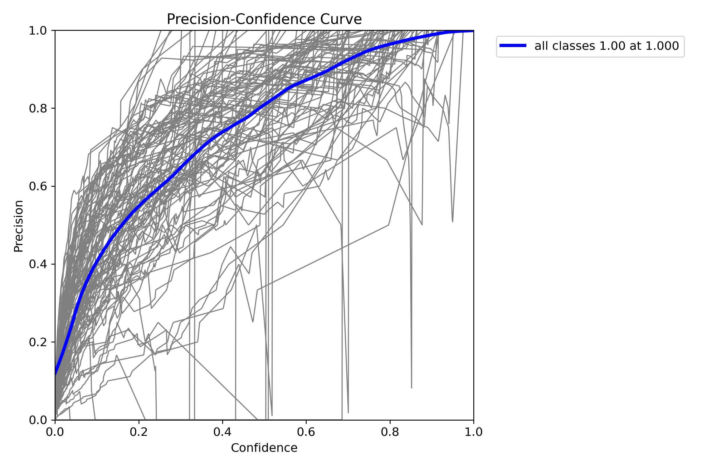
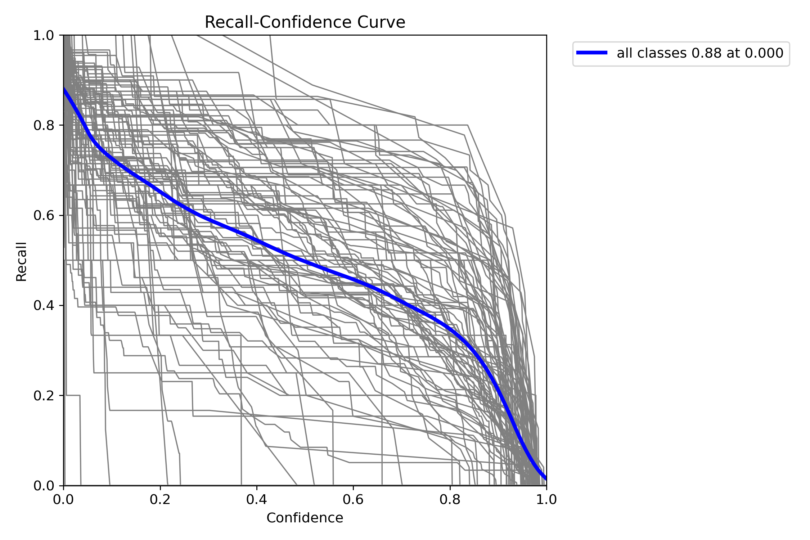

# Military-Aircraft-Detection


## Features

- 101 aircraft classes
- Real-time video inference (~100 FPS on RTX 4050)
- Image, video, and webcam input
- Aircraft metadata (country, role, key facts) attached to every detection
- Confidence-based warnings for visually similar aircraft
- JSON detection reports

## Performance

| Metric | Value |
|---|---|
| mAP@50 | 0.663 |
| mAP@50-95 | 0.556 |
| Precision | 0.682 |
| Recall | 0.576 |

Evaluated on the held-out test split (1,570 images). YOLOv8s, 640px, 73 epochs.

## Curves

<p align="center">
  
  
  
  
</p>

## Confusion Matrix

<p align="center">
  
</p>

## Predictions on Validation Data

<p align="center">
  
  
</p>

## Supported Aircraft

`F22` `F35` `F16` `F15` `F18` `F14` `F4` `B2` `B1` `B52` `F117` `SR71` `A10` `C130` `C17` `C5` `U2` `XB70` `Su57` `Mig31` `Tu95` `Tu160` `J20` `Rafale` `EF2000` `JAS39` `Mirage2000` `V22` `MQ9` `RQ4` `E2` `AG600` `Be200` `US2` `A400M` `KAAN` `AKINCI` `TB2` `An225` and 60+ more. Full list in [`data/data.yaml`](data/data.yaml).

## Requirements

- Python 3.8+
- PyTorch 2.0+
- Ultralytics
- OpenCV
- CUDA compatible GPU (recommended)

## Installation
```
git clone https://github.com/dhruvgaur10/military-aircraft-detection.git
cd military-aircraft-detection
pip install -r requirements.txt
```
## Usage
```
# Run on image
python scripts/detect.py --source test_files/image.jpg

# Run on video
python scripts/detect.py --source test_files/video.mp4

# Run on webcam
python scripts/detect.py --source 0

# Auto-open result after processing
python scripts/detect.py --source test_files/video.mp4 --play

# Adjust confidence threshold (default: 0.25)
python scripts/detect.py --source test_files/image.jpg --conf 0.5
```
## Training
```
python scripts/train.py --model yolov8s.pt --epochs 300 --batch 12
```

## Structure
```
military-aircraft-detection/
├── models/best.pt
├── data/
│ └── data.yaml
├── scripts/
│ ├── prepare_dataset.py
│ ├── train.py
│ ├── validate.py
│ └── detect.py
├── assets/
├── test_files/
├── requirements.txt
└── README.md
```
## Author

Dhruv Gaur
