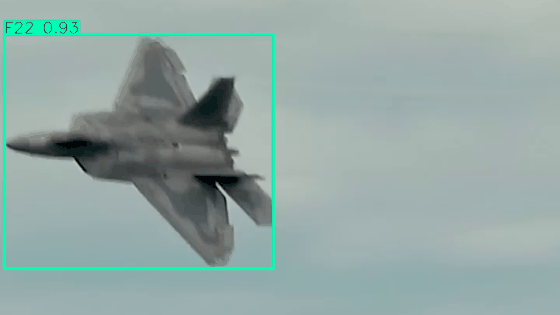
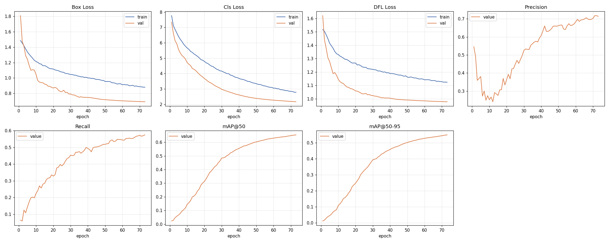
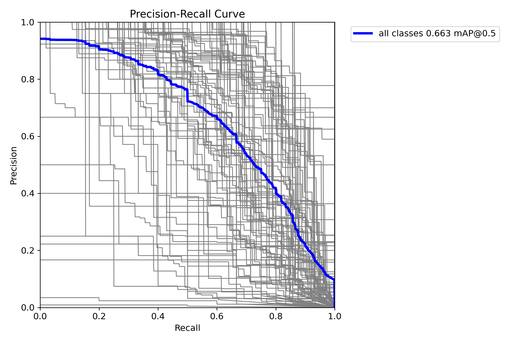
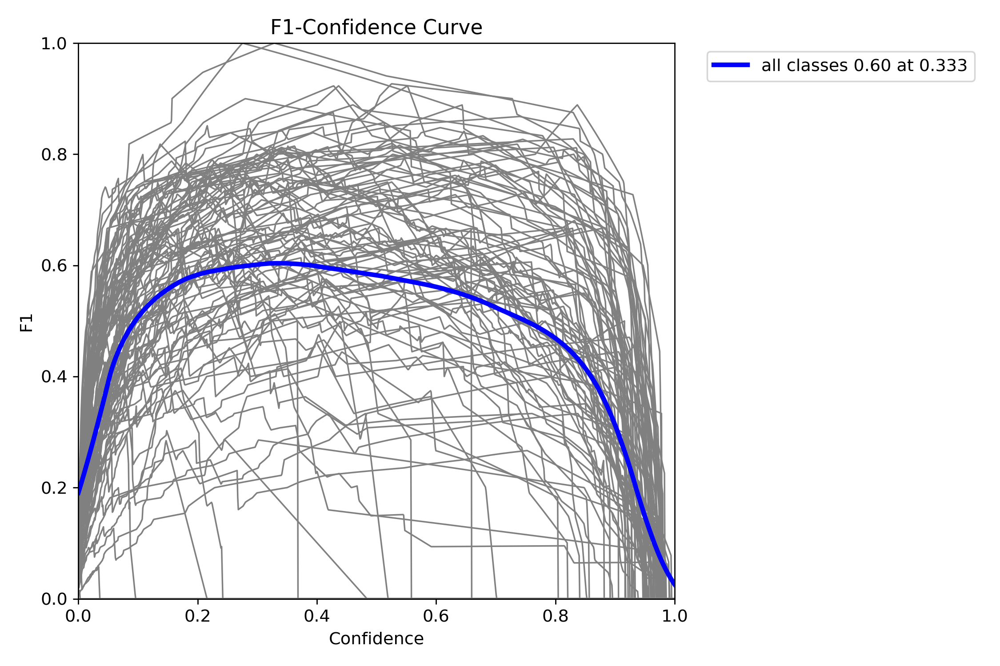
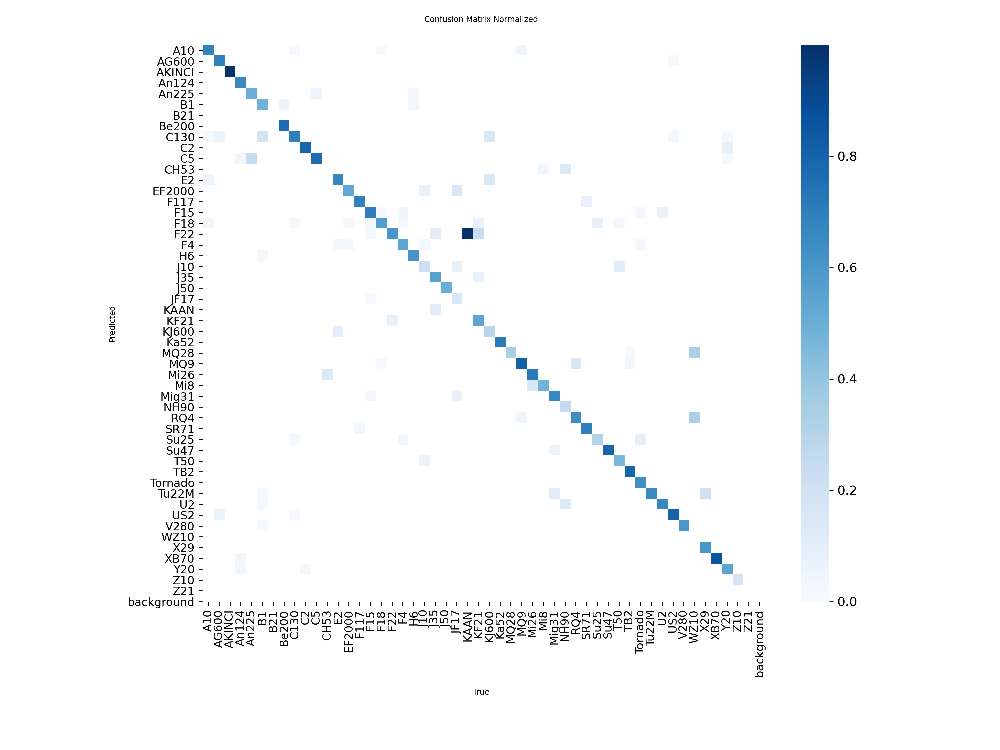
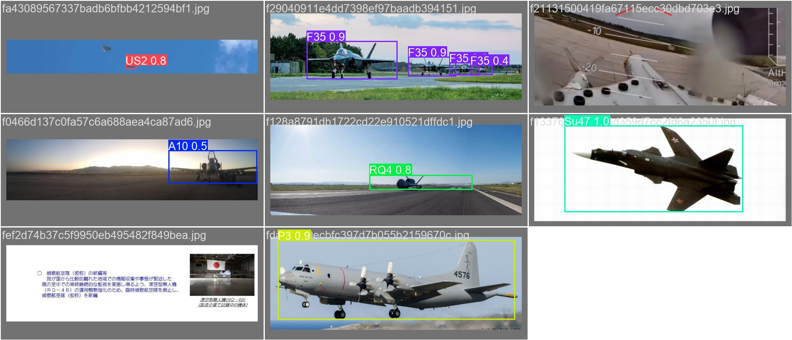
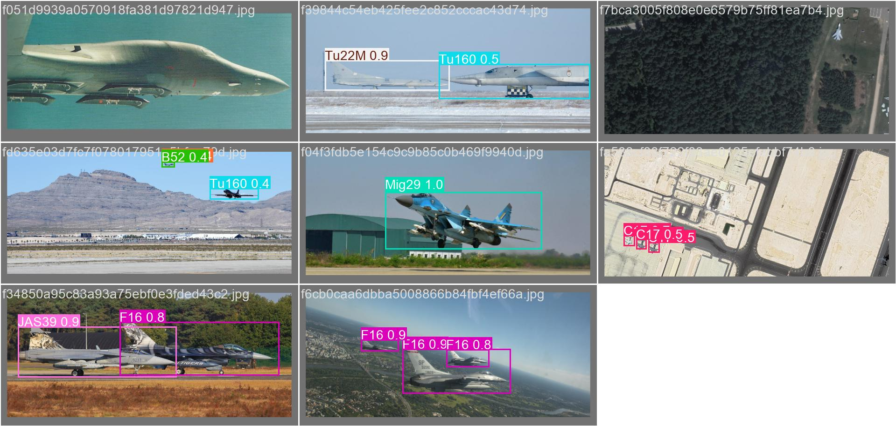

# Military-Aircraft-Detection



## Features

- 101 aircraft classes
- Real-time video inference (~100 FPS on RTX 4050)
- Image, video, and webcam input
- Aircraft metadata (country, role, key facts) attached to every detection
- Confidence-based warnings for visually similar aircraft
- JSON detection reports

## Performance

| Metric | Value |
|---|---|
| mAP@50 | 0.663 |
| mAP@50-95 | 0.556 |
| Precision | 0.682 |
| Recall | 0.576 |

Evaluated on the held-out test split (1,570 images). YOLOv8s, 640px, 73 epochs.

## Curves

<p align="center">
  
</p>
<p align="center">
  
  
</p>

## Confusion Matrix

<p align="center">
  
</p>

## Predictions on Validation Data

<p align="center">
  
  
</p>

## Supported Aircraft

<details>
<summary>View all 101 classes</summary>

`A10` `A400M` `AG600` `AH64` `AKINCI` `AV8B` `An124` `An22` `An225` `An72` `B1` `B2` `B21` `B52` `Be200` `C1` `C130` `C17` `C2` `C390` `C5` `CH47` `CH53` `CL415` `E2` `E7` `EF2000` `EMB314` `F117` `F14` `F15` `F16` `F18` `F2` `F22` `F35` `F4` `FCK1` `H6` `Il76` `J10` `J20` `J35` `J36` `J50` `JAS39` `JF17` `JH7` `KAAN` `KC135` `KF21` `KIZILELMA` `KJ600` `Ka27` `Ka52` `MQ25` `MQ28` `MQ35` `MQ9` `Mi24` `Mi26` `Mi28` `Mi8` `Mig29` `Mig31` `Mirage2000` `NH90` `P3` `RQ4` `Rafale` `SR71` `Su24` `Su25` `Su34` `Su47` `Su57` `T50` `TB001` `TB2` `Tejas` `Tornado` `Tu160` `Tu22M` `Tu95` `U2` `UH60` `US2` `V22` `V280` `Vulcan` `WZ10` `WZ7` `X29` `X32` `XB70` `XQ58` `Y20` `YF23` `Z10` `Z19` `Z21`

</details>

Full list also in [`data/data.yaml`](data/data.yaml).

## Requirements

- Python 3.8+
- PyTorch 2.0+
- Ultralytics
- OpenCV
- CUDA compatible GPU (recommended)

## Installation
```
git clone https://github.com/dhruvgaur10/military-aircraft-detection.git
cd military-aircraft-detection
pip install -r requirements.txt
```
## Usage
```
# Run on image
python scripts/detect.py --source test_files/image.jpg

# Run on video
python scripts/detect.py --source test_files/video.mp4

# Run on webcam
python scripts/detect.py --source 0

# Auto-open result after processing
python scripts/detect.py --source test_files/video.mp4 --play

# Adjust confidence threshold (default: 0.25)
python scripts/detect.py --source test_files/image.jpg --conf 0.5
```
## Training
```
python scripts/train.py --model yolov8s.pt --epochs 300 --batch 12
```

## Structure
```
military-aircraft-detection/
├── models/best.pt
├── data/
│ └── data.yaml
├── scripts/
│ ├── prepare_dataset.py
│ ├── train.py
│ ├── validate.py
│ └── detect.py
├── assets/
├── test_files/
├── requirements.txt
└── README.md
```
## Author

Dhruv Gaur
