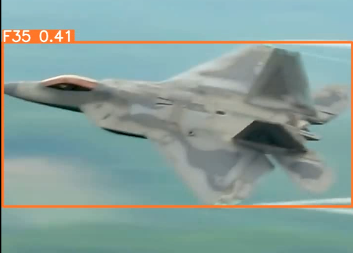

# Military-Aircraft-Detection

Real-time military aircraft detection system using YOLOv8. Detects and classifies 36 fighter jets, bombers, and reconnaissance aircraft from images, videos, and live feeds.



## Features

- Multi-class detection across 36 military aircraft.
- Real-time video inference at ~100 FPS (RTX 4050).
- GPU accelerated using CUDA and mixed precision.
- Supports image, video, and webcam input.
- Modular codebase with automatic path resolution.

## Supported Aircraft

`F-22` `F-35` `F-16` `F-15` `F-18` `F-14` `F-4` `B-2` `B-1` `B-52` `F-117` `SR-71` `A-10` `C-130` `C-17` `C-5` `U-2` `YF-23` `XB-70` `Su-57` `MiG-31` `Tu-95` `Tu-160` `J-20` `Rafale` `EF2000` `JAS-39` `Mirage-2000` `V-22` `MQ-9` `RQ-4` `E-2` `AG600` `Be200` `US-2` `A400M`

## Performance

- **Inference**: ~9ms/frame
- **Classes**: 36
- **Dataset**: 3,523 training images

## Requirements

- Python 3.8+
- PyTorch 2.0+
- Ultralytics
- OpenCV
- CUDA compatible GPU (recommended)

## Installation
```
git clone https://github.com/dhruvgaur10/military-aircraft-detection.git
cd military-aircraft-detection
pip install -r requirements.txt
```
## Usage
```
# Run on image
python scripts/detect.py --source test_files/image.jpg

# Run on video
python scripts/detect.py --source test_files/video.mp4

# Run on webcam
python scripts/detect.py --source 0

# Auto-open result after processing
python scripts/detect.py --source test_files/video.mp4 --play

# Adjust confidence threshold (default: 0.25)
python scripts/detect.py --source test_files/image.jpg --conf 0.5
```
## Training
```
python scripts/train.py
```

## Structure
```
military-aircraft-detection/
├── models/best.pt
├── data/
├── scripts/
│ ├── train.py
│ └── detect.py
├── requirements.txt
└── README.md
```
## Author

Dhruv Gaur